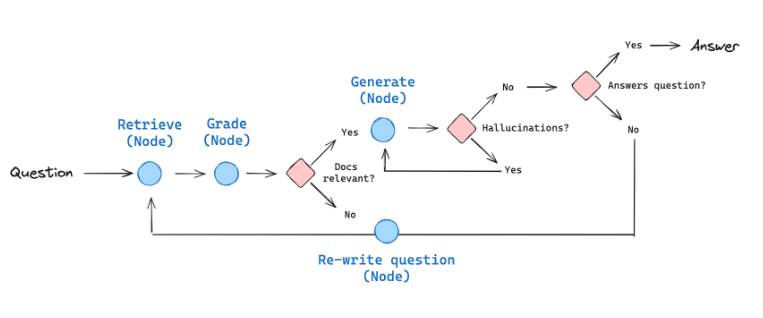

# Self-RAG Implementation

This project implements Self-RAG (Retrieval Augmented Generation with self-evaluation), a system that enhances language model responses through:

1. **Retrieval**: Fetches relevant information
2. **Grading**: Evaluates the quality of retrieved information
3. **Generation**: Creates responses based on relevant information
4. **Self-verification**: Detects hallucinations and verifies if the response is adequate

The system uses a pipeline architecture that allows reformulating questions when necessary to improve response quality.



## How to run

```bash
python main.py
```

Or directly with uvicorn:

```bash
uvicorn main:app --host 0.0.0.0 --port 8080 --reload
```

Access the API endpoint at http://localhost:8080
